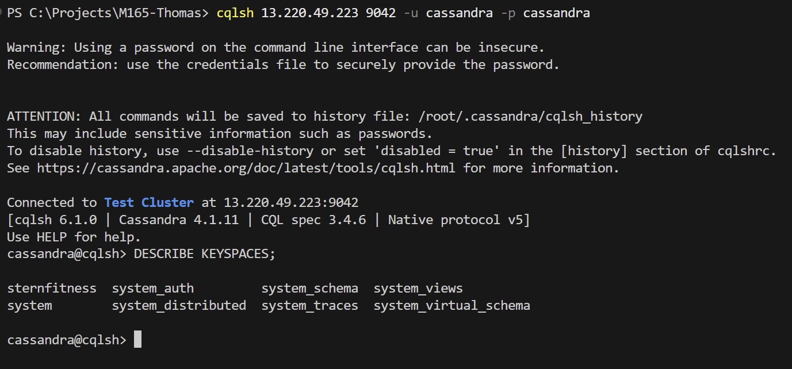
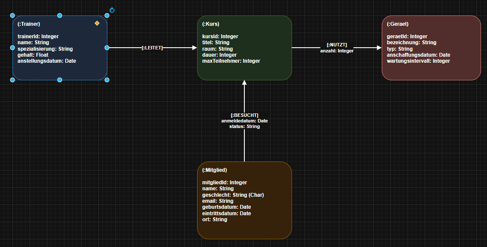
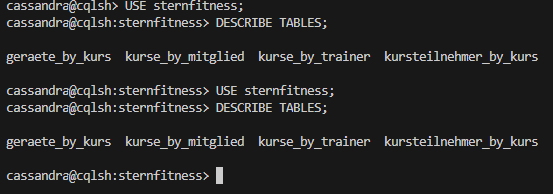

# KN-C-01: Installation und Datenmodellierung für Cassandra

## A) Installation / Verbindung

### Beschreibung
Cassandra wurde auf einer AWS-Instanz aufgesetzt. Die Verbindung erfolgt über das Command-Line-Tool `cqlsh`.

### Screenshots
**Verbindung mit cqlsh:**


---

## B) Logisches Modell für Cassandra

### Beschreibung
Cassandra arbeitet nach dem Query-First-Prinzip. Für jeden der vier Anwendungsfälle (Screens) des Fitnessstudios "SternFitness" wird eine eigene, passend denormalisierte Tabelle erstellt.

| Screen / Anwendungsfall | Tabelle | Partition-Key | Clustering-Key |
| :--- | :--- | :--- | :--- |
| Teilnehmerliste eines Kurses | `kursteilnehmer_by_kurs` | `kurs_id` | `status`, `mitglied_id` |
| Kursplan eines Mitglieds | `kurse_by_mitglied` | `mitglied_id` | `kurs_id` |
| Kurse eines Trainers | `kurse_by_trainer` | `trainer_id` | `kurs_id` |
| Gerätebedarf eines Kurses | `geraete_by_kurs` | `kurs_id` | `geraet_id` |

### Screenshots
**Visuelle Darstellung des Modells:**


---

## C) Physisches Modell für Cassandra

### Beschreibung
Die physische Implementierung erfolgt über das CQL-Skript `create_keyspace_and_tables.cql`.

### Befehle
- Ausführen des Skripts:
  ```bash
  cqlsh 13.220.49.223 9042 -u cassandra -p cassandra -f create_keyspace_and_tables.cql
  ```

### Screenshots
**Erstellte Tabellen in Cassandra:**

