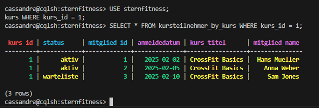
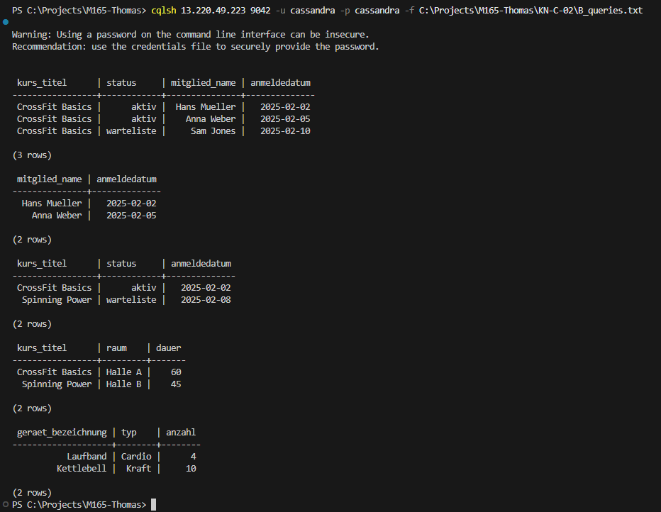
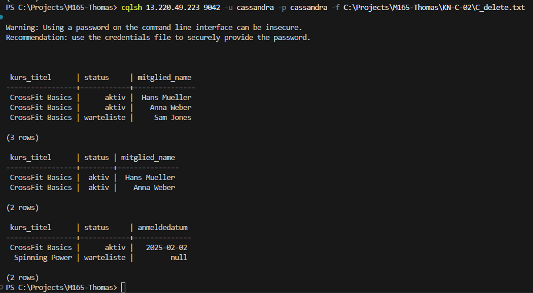
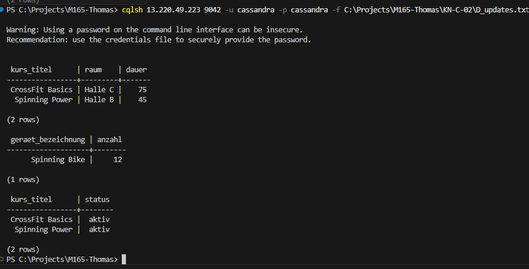

# KN-C-02: Datenabfrage und -Manipulation

## A) Daten hinzufügen

### Beschreibung
Die Tabellen des physischen Modells wurden mit Beispieldaten befüllt. Pro Partitions-Key existieren mehrere Datensätze.

### Befehle
- Ausführen des Einfügeskripts:
  ```bash
  cqlsh 13.220.49.223 9042 -u cassandra -p cassandra -f A_insert_data.txt
  ```

### Screenshots
**Eingefügte Daten in der Tabelle:**


---

## B) Daten abfragen

### Beschreibung
Es wurden 5 Szenario-Abfragen ausgeführt. Jede Abfrage filtert über den Partition-Key (dadurch ist kein `ALLOW FILTERING` nötig).

### Befehle
- Ausführen der Abfragen:
  ```bash
  cqlsh 13.220.49.223 9042 -u cassandra -p cassandra -f B_queries.txt
  ```

### Screenshots
**Ausgabe der 5 Szenario-Abfragen:**


---

## C) Daten löschen

### Beschreibung
Es wurde das Löschen einer ganzen Zeile sowie einer einzelnen Spalte (`anmeldedatum`) durchgeführt. Das Löschen einer Spalte setzt den Wert auf `null`, während die Zeile bestehen bleibt.

### Befehle
- Ausführen der Löschungen:
  ```bash
  cqlsh 13.220.49.223 9042 -u cassandra -p cassandra -f C_delete.txt
  ```

### Screenshots
**Ausgabe der Lösch-Befehle (Vorher/Nachher):**


---

## D) Daten verändern

### Beschreibung
Es wurden drei Update-Szenarien durchgeführt. Da `status` in `kursteilnehmer_by_kurs` Teil des Primärschlüssels ist, wurde dort ein `DELETE` gefolgt von einem `INSERT` ausgeführt.

### Befehle
- Ausführen der Updates:
  ```bash
  cqlsh 13.220.49.223 9042 -u cassandra -p cassandra -f D_updates.txt
  ```

### Screenshots
**Ausgabe der Updates:**

