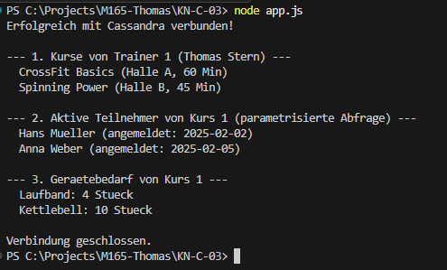

# KN-C-03: Programmierung mit Cassandra

## A) Installation & Ausführung

### Beschreibung
Einbindung des offiziellen Node.js Cassandra Treibers (`cassandra-driver`), um eine programmgesteuerte Verbindung zur Instanz aufzubauen und parametrisierte Abfragen auszuführen.

### Befehle
- Abhängigkeiten installieren und Applikation starten:
  ```bash
  npm install
  node app.js
  ```

---

## B) Programmausführung

### Screenshots
**Konsolenausgabe von app.js:**

