# Antworten zu KN-M-01

Aufgabenstellung: [KN-M-01.md](./KN-M-01.md)

## Teil A: Installation

**Abgabe: Cloud-Init Datei**

Siehe [cloud-init.yaml](./cloud-init.yaml).

**Abgabe: Screenshot von Compass mit der Liste der bereits bestehenden Datenbanken**

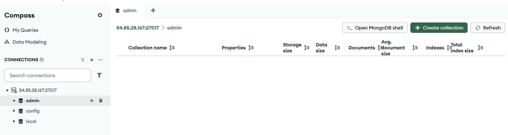

**Was macht die Option `authSource=admin` im Connection String und wieso ist dieser Parameter korrekt?**

Dieser Parameter gibt an, in welcher Datenbank die Authentifizierungsinformationen des Benutzers liegen. Standardmässig werden Administrationsbenutzer in der `admin`-Datenbank gespeichert. Wenn wir uns verbinden, teilt `authSource=admin` der Datenbank mit, dass sie in der `admin`-Datenbank nachschauen soll, ob die Anmeldedaten korrekt sind, auch wenn wir vielleicht auf eine andere Datenbank zugreifen möchten.

**Erklärung der beiden `sed`-Befehle im cloud-init:**

In der Standardinstallation lässt MongoDB nur lokale Verbindungen (`127.0.0.1`) zu und erfordert keine Authentifizierung.

1. Der erste `sed`-Befehl ändert die `bindIp` in der Konfigurationsdatei (`/etc/mongod.conf`) von `127.0.0.1` auf `0.0.0.0`. Dies ist notwendig, damit die Datenbank über das Netzwerk/Internet von aussen erreichbar ist.
2. Der zweite `sed`-Befehl aktiviert die Authentifizierung (`authorization: enabled` unter dem Abschnitt `security`). Ohne diesen Befehl könnte jeder, der die IP kennt, ohne Passwort auf die Datenbank zugreifen, was ein enormes Sicherheitsrisiko darstellt.

**Abgabe: Screenshot der `mongod.conf` mit den ersetzten Werten**

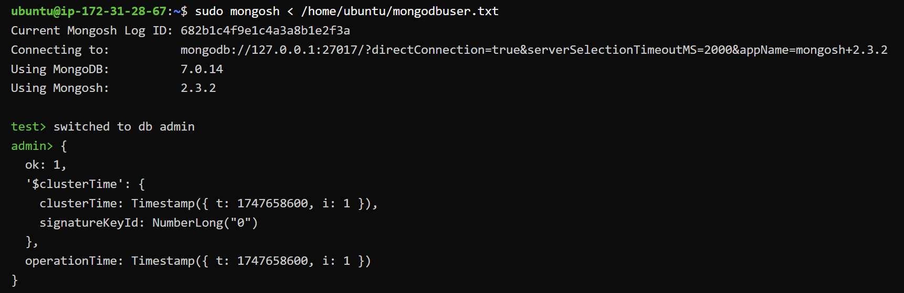

## Teil B: Erste Schritte GUI

**Abgabe: Screenshot des einzufügenden Dokuments (vor dem Einfügen)**

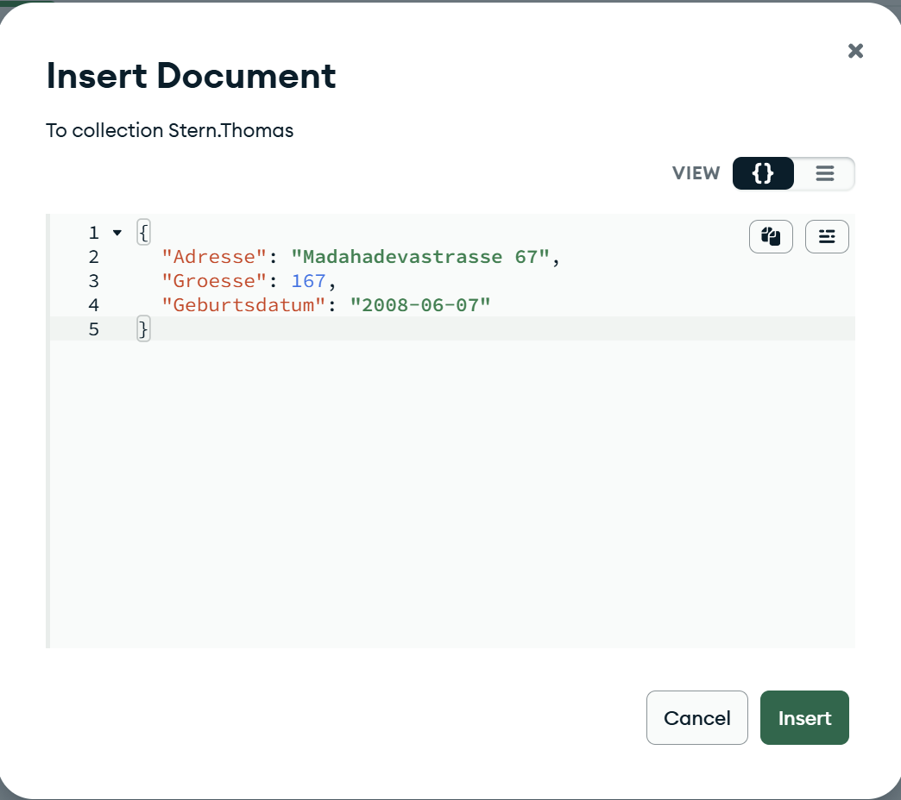

**Abgabe: Compass mit Datenbank, Collection und Dokument nach der Änderung des Datentyps auf Date**


**Abgabe: Export-Datei**

Siehe [5_export.json](./screenshots/5_export.json).

**Wieso ist dieser komplizierte Weg notwendig, um ein Datum zu definieren (Implikationen auf andere Datentypen)?**

Standard-JSON hat keine nativen Datentypen für Datumswerte (es kennt nur String, Number, Boolean, Null, Array, Object). Wenn man in einem gewöhnlichen JSON-Dokument ein Datum als Text (`"2023-10-01"`) eingibt, wird es in MongoDB auch nur als String gespeichert. Um MongoDB direkt beim Einfügen mitzuteilen, dass es ein echtes Datum (Date) ist, müsste man *MongoDB Extended JSON* verwenden (z.B. `{"$date": "2023-10-01T00:00:00Z"}`). Dieser Weg ist notwendig, da MongoDB intern BSON (Binary JSON) verwendet, welches viel mehr Datentypen (wie Date, ObjectId, etc.) unterstützt als das reine Text-JSON. Das gilt analog auch für andere BSON-spezifische Typen wie `ObjectId`, `NumberLong` oder `Decimal128`, die ebenfalls über Extended JSON definiert werden müssen.

## Teil C: Erste Schritte Shell

**Abgabe: Screenshot von Compass mit den eingegebenen Befehlen**

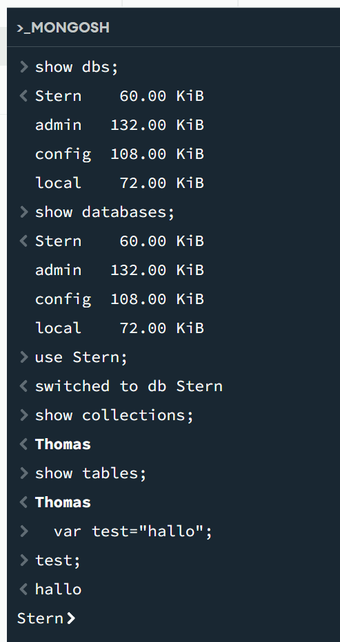

**Abgabe: Screenshot der MongoDB-Shell auf dem Linux-Server**

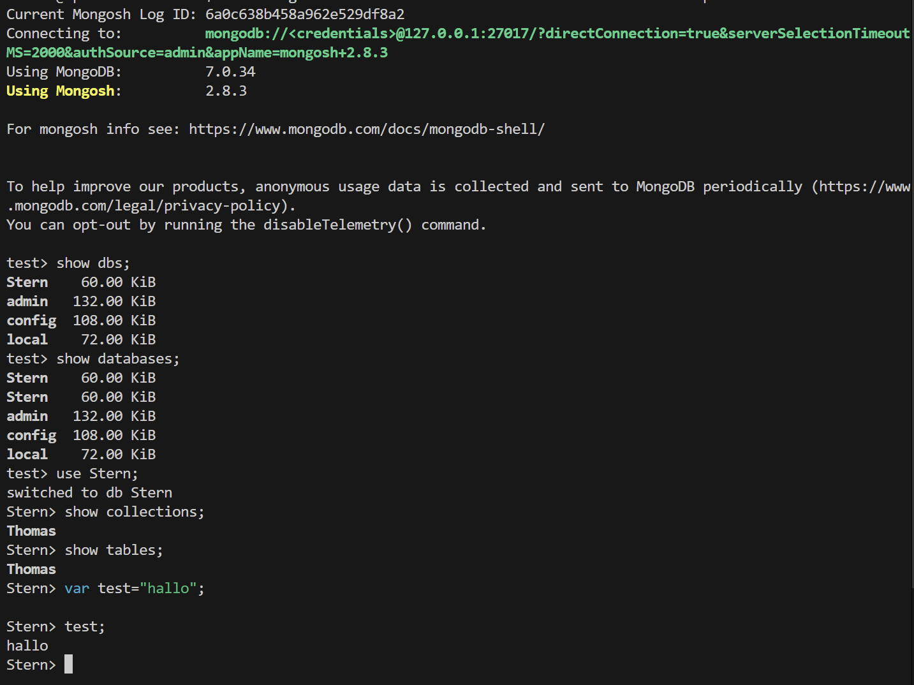

**Was machen die Befehle 1-5?**

1. `show dbs;` – Zeigt alle vorhandenen Datenbanken auf dem Server an.
2. `show databases;` – Ist ein Alias für `show dbs;` und macht exakt dasselbe.
3. `use <Datenbank>;` – Wechselt zur angegebenen Datenbank. Falls sie nicht existiert, wird sie im Speicher vorbereitet (und beim ersten Speichern von Daten physisch angelegt).
4. `show collections;` – Zeigt alle Collections in der aktuell ausgewählten Datenbank an.
5. `show tables;` – Ist ein Alias für `show collections;` (abgeleitet aus der SQL-Sprache) und macht dasselbe.

**Was ist der Unterschied zwischen Collections und Tables?**

*Tables (Tabellen)* werden in relationalen (SQL) Datenbanken verwendet und besitzen ein striktes Schema. Jede Zeile in einer Tabelle muss die gleichen Spalten mit fest definierten Datentypen haben.

*Collections* werden in NoSQL-Datenbanken wie MongoDB verwendet. Sie enthalten Dokumente (BSON) und sind schemalos. Das bedeutet, dass Dokumente innerhalb derselben Collection völlig unterschiedliche Strukturen, Felder und Datentypen haben können.

## Teil D: Rechte und Rollen

**Abgabe: Screenshot des Fehlers bei einer Verbindung mit der falschen Authentifizierungsquelle**

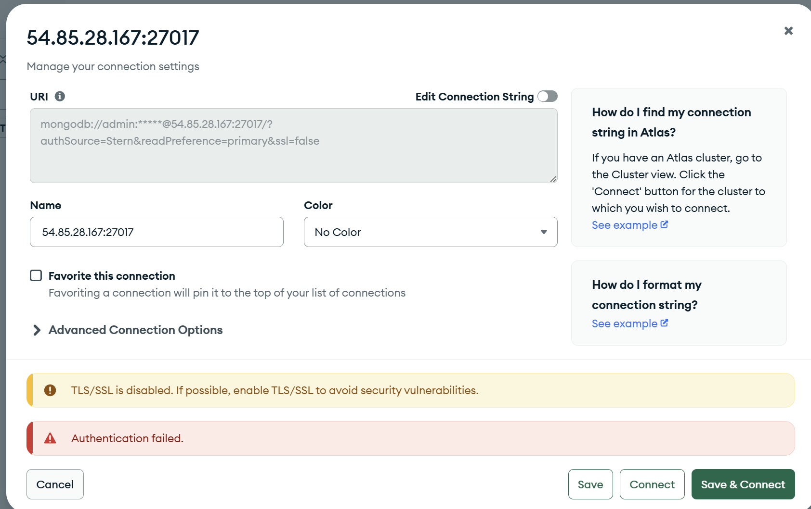

**Abgabe: Skript, welches die beiden Benutzer erstellt**

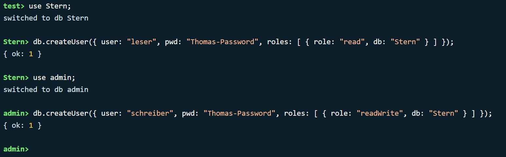

*(Hinweis: Als Zieldatenbank wird die Themendatenbank `SternFitness` verwendet. Das Passwort `Thomas-Password` ist ein reines Wegwerf-Passwort für die Abgabe und wird sonst nirgends verwendet.)*

```javascript
// Benutzer 1 erstellen (Nur Lesen, Authentifizierungsdatenbank: Themendatenbank)
use SternFitness;
db.createUser({
  user: "leser",
  pwd: "Thomas-Password",
  roles: [ { role: "read", db: "SternFitness" } ]
});

// Benutzer 2 erstellen (Lesen & Schreiben, Authentifizierungsdatenbank: admin)
use admin;
db.createUser({
  user: "schreiber",
  pwd: "Thomas-Password",
  roles: [ { role: "readWrite", db: "SternFitness" } ]
});
```

**Abgabe: Rechte Benutzer 1 (`leser`, nur lesen)**

Einloggen (Verbindungstext sichtbar):

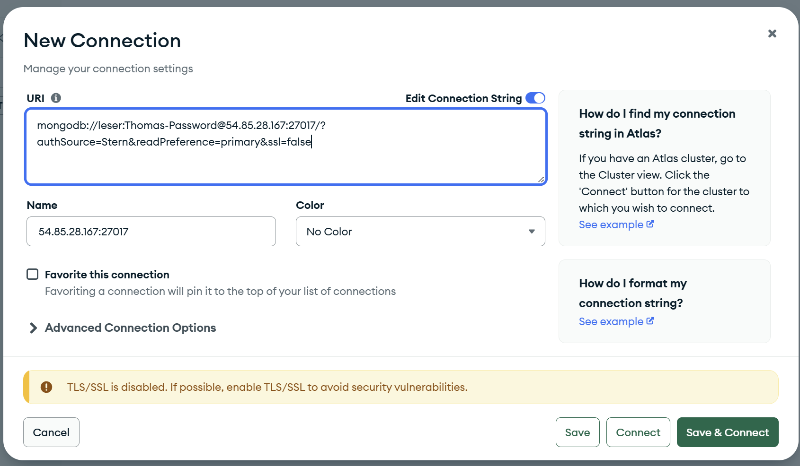

Lesen ohne Fehler:

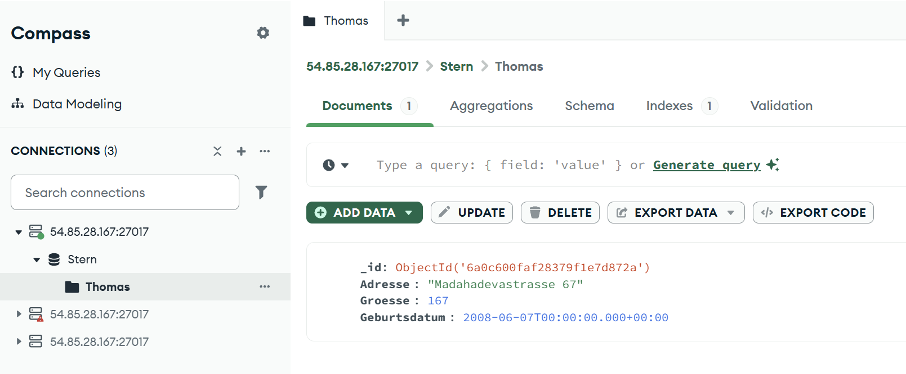

Schreiben mit Fehler:

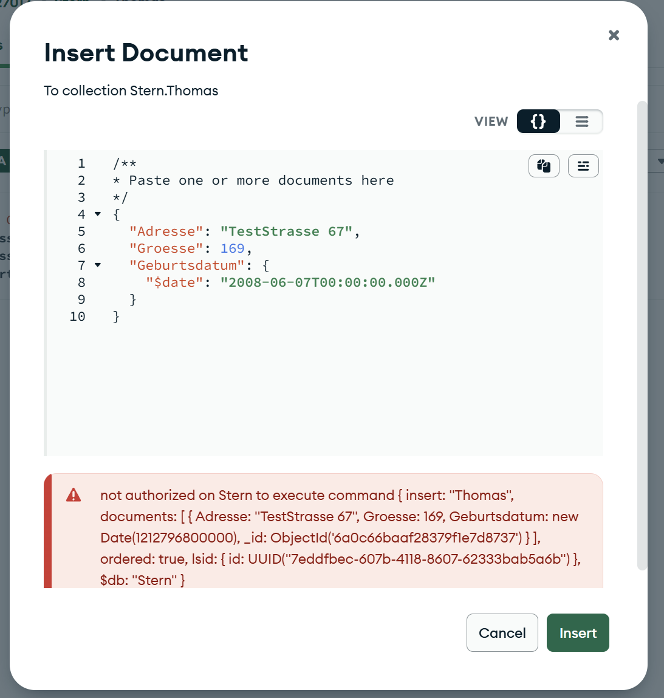

**Abgabe: Rechte Benutzer 2 (`schreiber`, lesen und schreiben)**

Einloggen (Verbindungstext sichtbar):

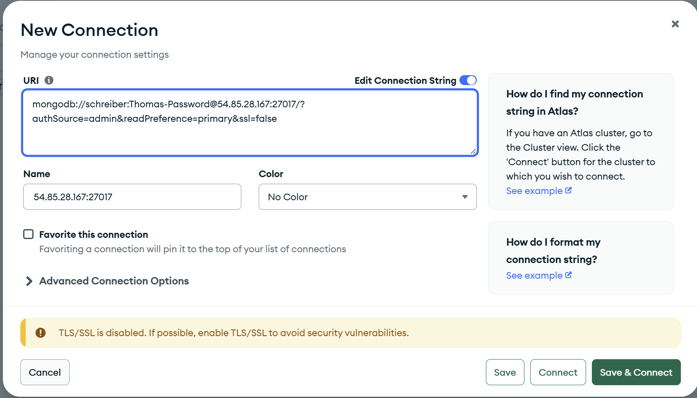

Lesen ohne Fehler:

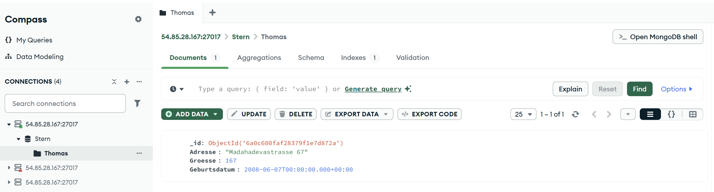

Schreiben ohne Fehler:

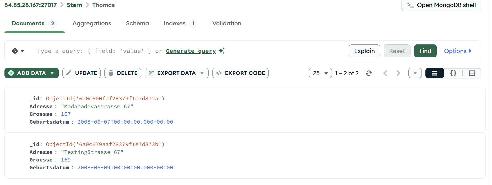
