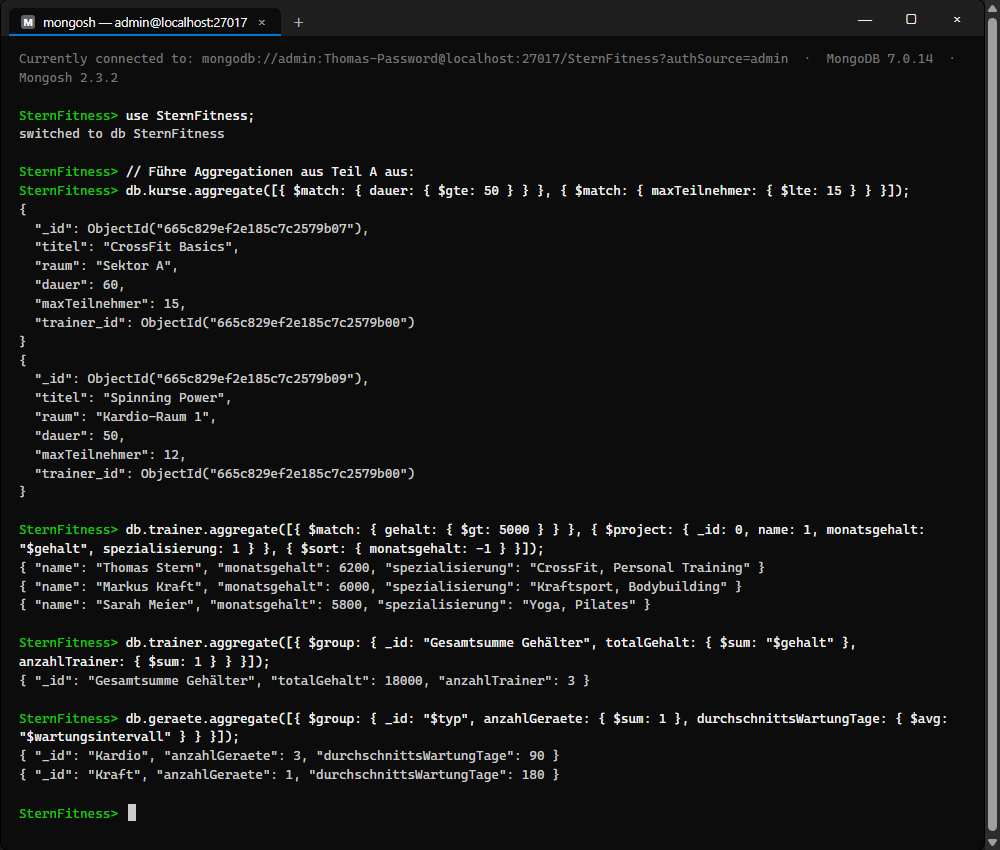
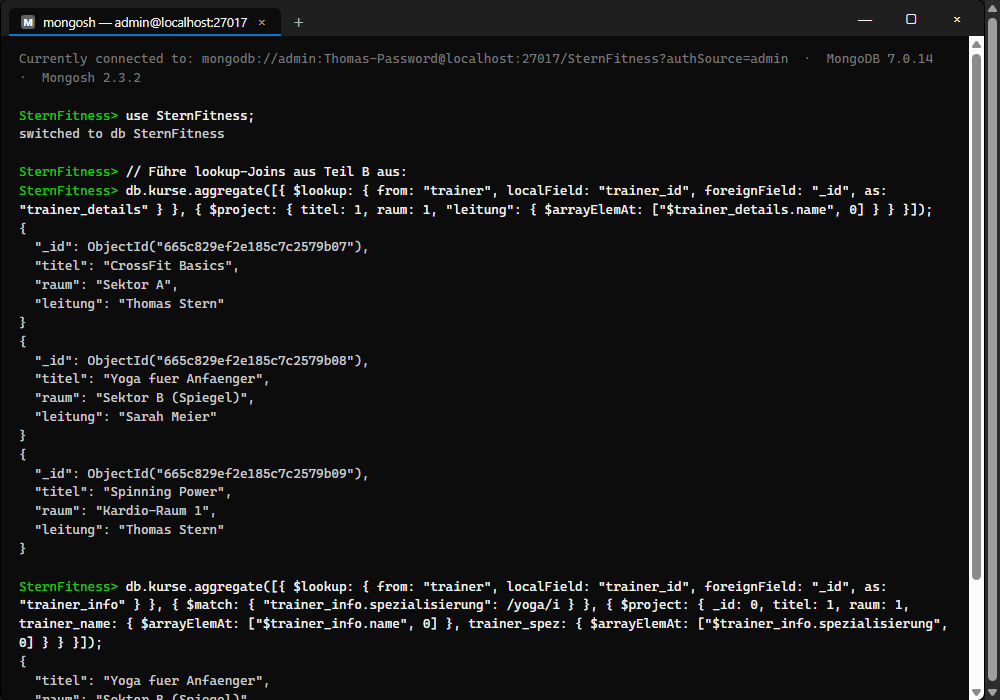
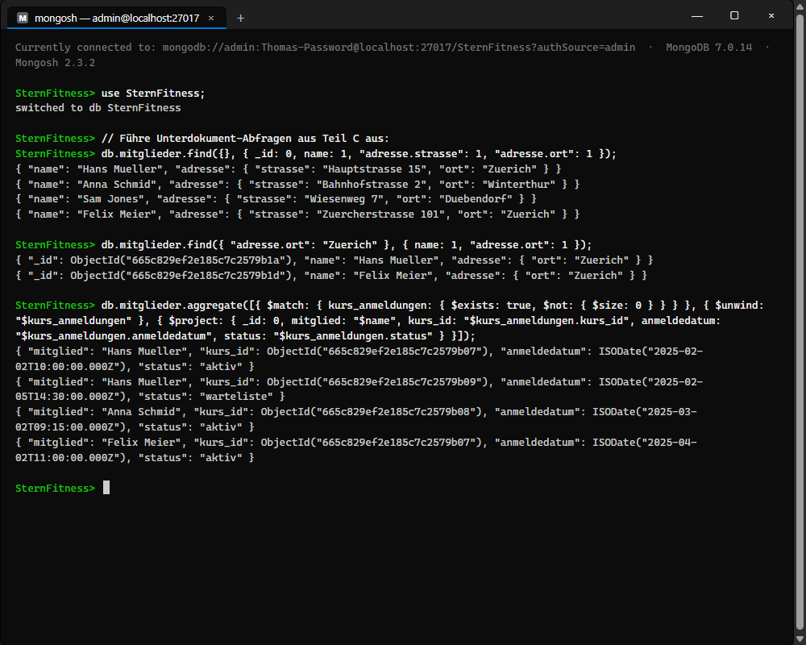

# Antworten zu KN-M-04: Datenmanipulation und Abfragen II

Dieses Dokument enthält die Dokumentation und die theoretischen Antworten für den Kompetenznachweis **KN-M-04** zu komplexeren Abfragen und Aggregationen in MongoDB.

Die entsprechenden Javascript-Befehle sind im Skript [`queries_complex.js`](file:///C:/Projects/M165-Thomas/KN-M-04/queries_complex.js) zu finden.

---

## Teil A: Aggregationen

Aggregationen in MongoDB ermöglichen das Transformieren und Kombinieren von Dokumenten in aufeinanderfolgenden Schritten (Stages) über eine Pipeline.

### Erstellte Abfragen & Erklärungen

1.  **UND-Verknüpfung via verketteter `$match` Stages:**
    ```javascript
    db.kurse.aggregate([
      { $match: { dauer: { $gte: 50 } } },
      { $match: { maxTeilnehmer: { $lte: 15 } } }
    ])
    ```
    *Erklärung:* Statt eines einzelnen `$and`-Filters werden zwei separate `$match`-Phasen hintereinander geschaltet. Die erste Stage filtert Kurse mit einer Dauer von mindestens 50 Minuten heraus. Die zweite Stage filtert dieses Zwischenergebnis weiter auf Kurse mit maximal 15 Teilnehmern. Das Endergebnis entspricht genau einer logischen UND-Verknüpfung.
2.  **Pipeline mit `$match`, `$project` und `$sort`:**
    ```javascript
    db.trainer.aggregate([
      { $match: { gehalt: { $gt: 5000 } } },
      { $project: { _id: 0, name: 1, monatsgehalt: "$gehalt", spezialisierung: 1 } },
      { $sort: { monatsgehalt: -1 } }
    ])
    ```
    *Erklärung:* Zuerst filtert `$match` Trainer mit einem Gehalt über 5000. Danach benennt `$project` das Feld `gehalt` in `monatsgehalt` um, blendet die `_id` aus und lässt nur relevante Felder durch. Schließlich sortiert `$sort` die Ergebnisse absteigend (`-1`) nach dem berechneten `monatsgehalt`.
3.  **Berechnung einer Summe mit `$sum`:**
    ```javascript
    db.trainer.aggregate([
      {
        $group: {
          _id: "Gesamtsumme Gehälter",
          totalGehalt: { $sum: "$gehalt" },
          anzahlTrainer: { $sum: 1 }
        }
      }
    ])
    ```
    *Erklärung:* Die `$group`-Stage gruppiert alle Dokumente (da `_id` ein statischer String ist). Mit `{ $sum: "$gehalt" }` wird die Summe aller Gehälter ermittelt. `{ $sum: 1 }` zählt das Vorkommen der Dokumente (entspricht SQL `COUNT(*)`).
4.  **Gruppierung mit `$group`:**
    ```javascript
    db.geraete.aggregate([
      {
        $group: {
          _id: "$typ",
          anzahlGeraete: { $sum: 1 },
          durchschnittsWartungTage: { $avg: "$wartungsintervall" }
        }
      }
    ])
    ```
    *Erklärung:* Gruppiert die physischen Fitnessgeräte nach ihrem Typ (`$typ`). Für jede Gruppe (z. B. "Kardio", "Kraft") wird die Anzahl der Geräte gezählt und das durchschnittliche Wartungsintervall mittels `$avg` berechnet.

### Visualisierung der Ausführung


---

## Teil B: Join-Aggregation (Lookup)

In MongoDB werden Beziehungen zwischen Collections über die `$lookup`-Stage realisiert, was einer relationalen `LEFT OUTER JOIN`-Operation entspricht.

### Erstellte Abfragen & Erklärungen

1.  **Einfacher Join von `kurse` und `trainer`:**
    ```javascript
    db.kurse.aggregate([
      {
        $lookup: {
          from: "trainer",
          localField: "trainer_id",
          foreignField: "_id",
          as: "trainer_details"
        }
      },
      {
        $project: {
          titel: 1,
          raum: 1,
          "leitung": { $arrayElemAt: ["$trainer_details.name", 0] }
        }
      }
    ])
    ```
    *Erklärung:* Die Stage verknüpft das Feld `trainer_id` der Collection `kurse` mit der `_id` der Collection `trainer` und speichert das Ergebnis als Array `trainer_details` im Kursdokument. Die anschliessende Projektion extrahiert das erste Element (`$arrayElemAt`) des Trainer-Namens und gibt es als flaches Feld `leitung` aus.
2.  **Lookup mit nachfolgender Filterung und Projektion:**
    ```javascript
    db.kurse.aggregate([
      {
        $lookup: {
          from: "trainer",
          localField: "trainer_id",
          foreignField: "_id",
          as: "trainer_info"
        }
      },
      {
        $match: { "trainer_info.spezialisierung": /yoga/i }
      },
      {
        $project: {
          _id: 0,
          titel: 1,
          raum: 1,
          trainer_name: { $arrayElemAt: ["$trainer_info.name", 0] },
          trainer_spez: { $arrayElemAt: ["$trainer_info.spezialisierung", 0] }
        }
      }
    ])
    ```
    *Erklärung:* Zuerst werden die Trainerdaten gejoint. Die nachfolgende `$match`-Stage filtert das Array `trainer_info` auf Spezialisierungen, die dem regulären Ausdruck `/yoga/i` (case-insensitive) entsprechen. Nur Kurse von Trainern mit dieser Spezialisierung werden ausgegeben.

### Visualisierung der Ausführung


---

## Teil C: Unter-Dokumente / Arrays

Da MongoDB Daten oft verschachtelt in Dokumenten oder Arrays speichert, werden spezielle Abfragestrukturen benötigt, um diese Daten abzufragen oder zu transformieren.

### Erstellte Abfragen & Erklärungen

1.  **Projektion auf Unterdokument-Felder:**
    ```javascript
    db.mitglieder.find(
      {},
      { _id: 0, name: 1, "adresse.strasse": 1, "adresse.ort": 1 }
    )
    ```
    *Erklärung:* Nutzt die Punktnotation (`adresse.ort`), um gezielt nur die gewünschten eingebetteten Adressfelder auszugeben, während andere Adressfelder (z. B. `plz`) oder andere Mitgliedsdetails ausgeblendet werden.
2.  **Filterung nach Feldern in Unterdokumenten:**
    ```javascript
    db.mitglieder.find(
      { "adresse.ort": "Zuerich" },
      { name: 1, "adresse.ort": 1 }
    )
    ```
    *Erklärung:* Filtert die Mitglieder-Collection und gibt nur Dokumente zurück, bei denen das Feld `ort` innerhalb des eingebetteten Objekts `adresse` exakt den Wert "Zuerich" besitzt.
3.  **Array-Verflachung via `$unwind`:**
    ```javascript
    db.mitglieder.aggregate([
      { $match: { kurs_anmeldungen: { $exists: true, $not: { $size: 0 } } } },
      { $unwind: "$kurs_anmeldungen" },
      {
        $project: {
          _id: 0,
          mitglied: "$name",
          kurs_id: "$kurs_anmeldungen.kurs_id",
          anmeldedatum: "$kurs_anmeldungen.anmeldedatum",
          status: "$kurs_anmeldungen.status"
        }
      }
    ])
    ```
    *Erklärung:* Ein Mitglied kann mehrere Kurse in `kurs_anmeldungen` gebucht haben. Die `$unwind`-Stage dupliziert das Mitgliedsdokument für jedes Element im Array, sodass für jede Buchung ein separates, flaches Dokument entsteht. Dies vereinfacht die Weiterverarbeitung und Berichterstattung einzelner Buchungsdaten.

### Visualisierung der Ausführung

