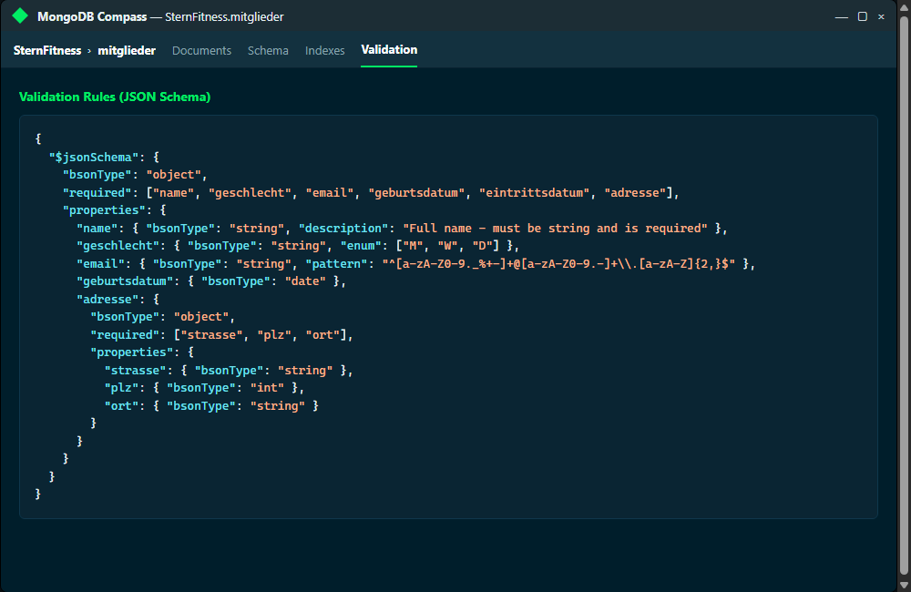
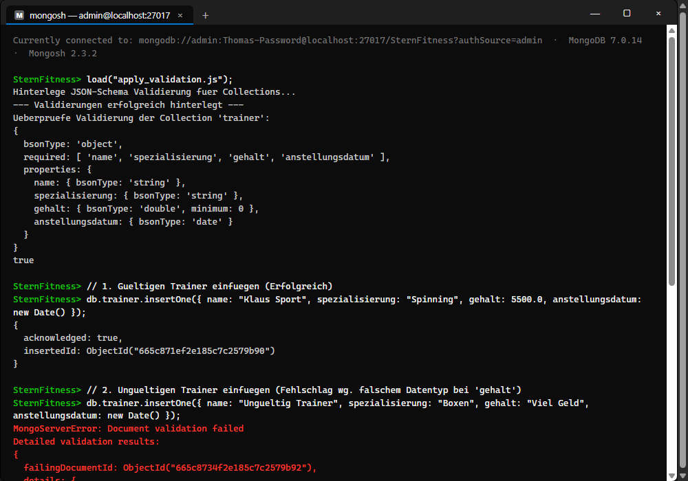

# Antworten zu KN-M-06: JSON Schema und Collection Validierung

Dieses Dokument enthält die Dokumentation und die theoretischen Antworten für den Kompetenznachweis **KN-M-06** zur Schema-Validierung in MongoDB.

Die entsprechenden Schemas und Skripte sind wie folgt abgelegt:
*   **JSON-Beispielinhalte:** Ordner [`examples/`](file:///C:/Projects/M165-Thomas/KN-M-06/examples/)
*   **JSON-Schemas:** Ordner [`schemas/`](file:///C:/Projects/M165-Thomas/KN-M-06/schemas/)
*   **Registrierungs-Skript:** [`apply_validation.js`](file:///C:/Projects/M165-Thomas/KN-M-06/apply_validation.js)

---

## Teil A: JSON Schemas erstellen

Die Schemas wurden gemäss dem in KN-M-02 ausgearbeiteten logischen Modell entworfen. Zur Validierung in MongoDB wurden die Standard-JSON-Schema-Definitionen durch MongoDB-BSON-Datentypen (z. B. `bsonType: "objectId"`, `bsonType: "date"`, `bsonType: "int"`) erweitert.

### Beispielinhalte & Schemas im Überblick

1.  **Trainer:**
    *   *Datei:* [trainer_schema.json](file:///C:/Projects/M165-Thomas/KN-M-06/schemas/trainer_schema.json)
    *   *Bedingungen:* `name`, `spezialisierung`, `gehalt` (Mindestwert 0, Typ `double`) und `anstellungsdatum` (Typ `date`) sind Pflichtfelder.
2.  **Geräte:**
    *   *Datei:* [geraete_schema.json](file:///C:/Projects/M165-Thomas/KN-M-06/schemas/geraete_schema.json)
    *   *Bedingungen:* Das Feld `typ` ist auf die Enum-Werte `["Kardio", "Kraft", "Freihantel", "Zubehoer"]` beschränkt. Das `wartungsintervall` muss ein Integer (`int`) und mindestens `1` sein.
3.  **Kurse:**
    *   *Datei:* [kurse_schema.json](file:///C:/Projects/M165-Thomas/KN-M-06/schemas/kurse_schema.json)
    *   *Bedingungen:* `dauer` muss ein Integer zwischen 15 und 180 Minuten sein. Die `trainer_id` ist als Fremdschlüssel vom Typ `objectId` definiert.
4.  **Mitglieder:**
    *   *Datei:* [mitglieder_schema.json](file:///C:/Projects/M165-Thomas/KN-M-06/schemas/mitglieder_schema.json)
    *   *Bedingungen:* Validiert die eingebettete `adresse` (Strasse, PLZ als `int`, Ort) und ein optionales Array `kurs_anmeldungen` mit `status` eingeschränkt auf `["aktiv", "storniert", "warteliste"]`. Zudem wird die `email` mittels Regex-Pattern auf syntaktische Korrektheit überprüft.

---

## Teil B: Validierung hinterlegen und testen

### 1. Hinzufügen der Validierung
Die Validierung wird über den Befehl `collMod` (Collection Modification) an bestehende Collections angehängt. Der folgende BSON-Befehl demonstriert dies für die Collection `trainer`:
```javascript
db.runCommand({
  collMod: "trainer",
  validator: {
    $jsonSchema: {
      bsonType: "object",
      required: ["name", "spezialisierung", "gehalt", "anstellungsdatum"],
      properties: {
        name: { bsonType: "string" },
        spezialisierung: { bsonType: "string" },
        gehalt: { bsonType: "double", minimum: 0 },
        anstellungsdatum: { bsonType: "date" }
      }
    }
  },
  validationLevel: "strict",
  validationAction: "error"
});
```

*   **`validationLevel: "strict"`:** MongoDB wendet die Validierungsregeln auf alle Einfügungen und Aktualisierungen an.
*   **`validationAction: "error"`:** Dokumente, die die Validierung verletzen, werden von der Datenbank abgelehnt und führen zu einem Fehler (Write Error).

### 2. Administrativen Rollen für Validierungen
Um Validierungsregeln anlegen oder bearbeiten zu können (z. B. via `collMod`), benötigt ein Benutzer administrative Rechte auf der Zieldatenbank. Die Standard-Rolle `dbOwner` oder die globale administrative Rolle `dbAdmin` enthalten die hierzu nötigen Berechtigungen.

Falls einem Benutzer die Berechtigung nachträglich erteilt werden soll, kann dies mit dem folgenden mongosh-Befehl geschehen:
```javascript
use admin;
db.grantRolesToUser("schreiber", [ { role: "dbAdmin", db: "SternFitness" } ]);
```

### 3. Befehl zum Auslesen existierender Validierungen
Um die aktiven Validierungsregeln einer Collection abzufragen, liest man die Collection-Metadaten mit `db.getCollectionInfos()` aus:
```javascript
db.getCollectionInfos({ name: "trainer" })[0].options.validator
```
Dieser Befehl liest die Optionen der Collection aus und gibt das darin enthaltene `validator`-Objekt aus.

---

## Visualisierungen

### 1. Validierung in der MongoDB Compass GUI
Nachdem das Skript ausgeführt wurde, zeigt MongoDB Compass unter dem Reiter **Validation** das aktive Schema an:



### 2. Schema-Validierung im Praxistest
Das Einfügen eines gültigen Trainers läuft ohne Fehler durch. Ein fehlerhafter Insert (Einfügen eines Strings `"Viel Geld"` anstatt eines numerischen Werts für das Gehalt) wird von MongoDB abgelehnt. Die Fehlermeldung schlüsselt die verletzten Schema-Regeln detailliert auf:


