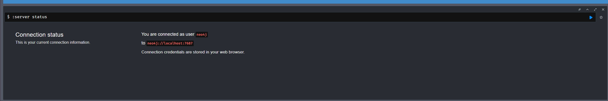
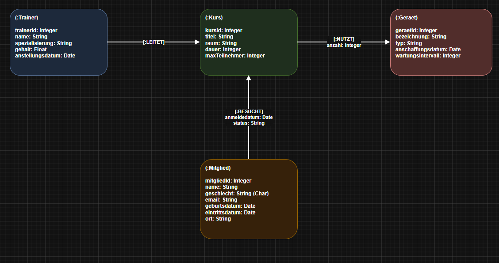

# Antworten zu KN-N-01: Installation und Datenmodellierung für Neo4j

Aufgabenstellung: [KN-N-01.md](./KN-N-01.md)

Als Grundlage dient das **gleiche konzeptionelle Modell** wie im MongoDB-Block (siehe [KN-M-02](../KN-M-02/README.md)) – die Themenwelt des Fitnessstudios **"SternFitness"** mit den Entitäten Mitglied, Trainer, Kurs und Gerät.

---

## Teil A: Installation / Account erstellen

Für diese Arbeit wurde **Neo4j Desktop** installiert und eine lokale Datenbank (DBMS) erstellt. Alternativ ist der kostenlose Cloud-Dienst **Neo4j Aura** möglich.

### Schritt-für-Schritt (Neo4j Desktop)
1. [Neo4j Desktop herunterladen](https://neo4j.com/download/) und installieren. Beim ersten Start den angezeigten **Activation Key** eintragen (wird auf der Download-Seite angezeigt).
2. Im Desktop links auf **"+ New"** → **"Create project"** klicken und das Projekt z. B. `SternFitness` nennen.
3. Im Projekt auf **"Add"** → **"Local DBMS"** klicken.
   - **Name:** `SternFitness-DB`
   - **Passwort:** `Thomas-Password`  *(reines Wegwerf-Passwort für die Abgabe – wird sonst nirgends verwendet)*
   - **Version:** aktuellste 5.x belassen → **"Create"**.
4. Den Mauszeiger über das DBMS bewegen und auf **"Start"** klicken. Sobald der Status **"Active"** (grün) ist, auf **"Open"** klicken, um den **Neo4j Browser** zu öffnen.
5. Im Neo4j Browser oben den Verbindungsstatus prüfen. Der Standard-Benutzer ist `neo4j`, das Passwort ist das oben gesetzte `Thomas-Password`.

> Verbindungsdaten (Bolt): `neo4j://localhost:7687`, Benutzer `neo4j`, Passwort `Thomas-Password`.
> Bei Neo4j Aura lautet die URI stattdessen `neo4j+s://<id>.databases.neo4j.io`.

**Abgabe: Screenshot, der die funktionierende Verbindung zeigt**

*(Reproduktion: Screenshot des Neo4j Browser nach dem Verbindungsaufbau, in dem das Kommando `:server status` bzw. die grüne "Connected"-Anzeige sichtbar ist.)*

---

## Teil B: Logisches Modell für Neo4j

Beim Property-Graph-Modell von Neo4j werden die Entitäten zu **Knoten (Labels)** und die Beziehungen zu gerichteten **Kanten (Relationship-Types)**. Im Gegensatz zum Dokumentenmodell (MongoDB) wird hier **nicht eingebettet**, sondern jede fachliche Verbindung explizit als Kante abgebildet.

### Diagramm & Quelldatei
- **Original-Datei:** [logical_model.drawio](file:///C:/Projects/M165-Thomas/KN-N-01/logical_model.drawio)
- **Visualisierung:**

*(Reproduktion: `logical_model.drawio` in [draw.io](https://app.diagrams.net/) öffnen und via **File → Export as → PNG** als `02_logical_model.png` in `KN-N-01/screenshots/` speichern.)*

### Knoten (Labels) und ihre Attribute

| Label | Attribute |
| :--- | :--- |
| `(:Mitglied)` | `mitgliedId`, `name`, `geschlecht`, `email`, `geburtsdatum`, `eintrittsdatum`, `ort` |
| `(:Trainer)` | `trainerId`, `name`, `spezialisierung`, `gehalt`, `anstellungsdatum` |
| `(:Kurs)` | `kursId`, `titel`, `raum`, `dauer`, `maxTeilnehmer` |
| `(:Geraet)` | `geraetId`, `bezeichnung`, `typ`, `anschaffungsdatum`, `wartungsintervall` |

### Kanten (Relationship-Types) und ihre Attribute

| Kante | Von → Nach | Kardinalität | Attribute |
| :--- | :--- | :--- | :--- |
| `[:LEITET]` | `Trainer → Kurs` | 1:N | – |
| `[:BESUCHT]` | `Mitglied → Kurs` | N:N | `anmeldedatum` (Date), `status` (String) |
| `[:NUTZT]` | `Kurs → Geraet` | N:N | `anzahl` (Integer) |

### Erklärung: Warum liegen welche Attribute auf Knoten bzw. Kanten?

Die Faustregel lautet: Ein Attribut, das eine **Entität selbst** beschreibt, gehört auf den **Knoten**. Ein Attribut, das nur im Kontext einer **konkreten Beziehung** zwischen zwei Entitäten Sinn ergibt, gehört auf die **Kante**.

- **`anmeldedatum` und `status` auf `[:BESUCHT]`:** Das Anmeldedatum und der Status (`aktiv`, `storniert`, `warteliste`) beschreiben weder das Mitglied noch den Kurs für sich allein, sondern **genau die eine Anmeldung** eines bestimmten Mitglieds zu einem bestimmten Kurs. Dasselbe Mitglied kann in Kurs A `aktiv` und in Kurs B auf der `warteliste` sein. Würde man `status` auf den Mitglied-Knoten legen, ginge diese Mehrfach-Zuordnung verloren. Deshalb ist die Kante der korrekte Ort. *(Damit ist die Bedingung "mindestens eine Kante mit Attributen" erfüllt.)*
- **`anzahl` auf `[:NUTZT]`:** Wie viele Exemplare eines Geräts ein Kurs benötigt, ist spezifisch für die Kombination *Kurs ↔ Gerät* (Spinning Power braucht 10 Bikes, ein anderer Kurs evtl. nur 1). Es ist keine Eigenschaft des Geräts an sich.
- **`gehalt`, `spezialisierung` auf `(:Trainer)`:** Diese Werte gehören eindeutig zur Person Trainer und sind unabhängig davon, welche Kurse sie leitet – daher auf dem Knoten.
- **`[:LEITET]` ohne Attribute:** Die reine Leitungs-Zuordnung benötigt keine zusätzlichen Daten; die Existenz der Kante ist die Information.

### Vergleich zum MongoDB-Modell
Im MongoDB-Modell (KN-M-02) wurden Adresse und Kursanmeldungen in das Mitglied **eingebettet**. Im Graph-Modell wird die Anmeldung stattdessen zur **Kante `[:BESUCHT]`**. Das ist der zentrale Vorteil von Neo4j: Beziehungen sind "First-Class-Citizens" und lassen sich (inkl. ihrer Attribute) effizient in beide Richtungen traversieren – ideal für Auswertungen wie "welche Mitglieder teilen einen Kurs".
