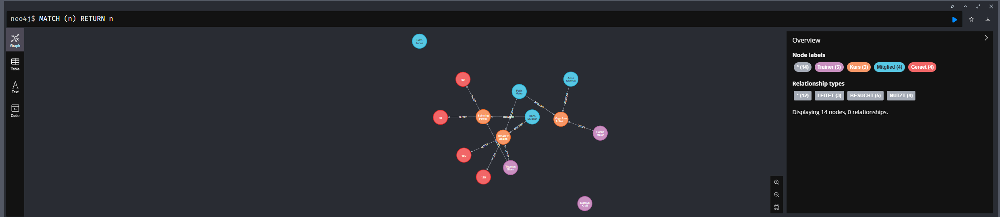
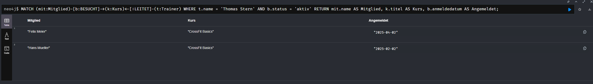
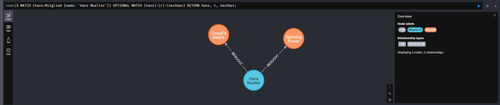
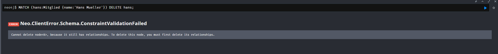
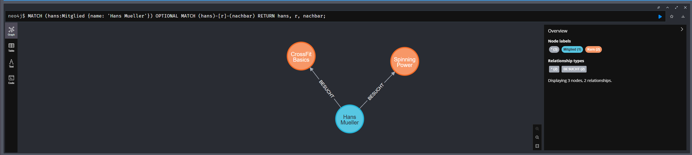
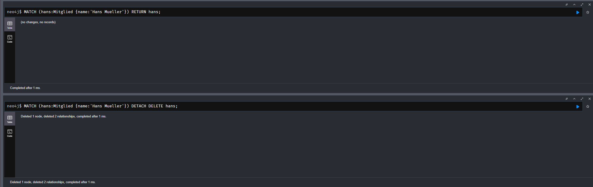
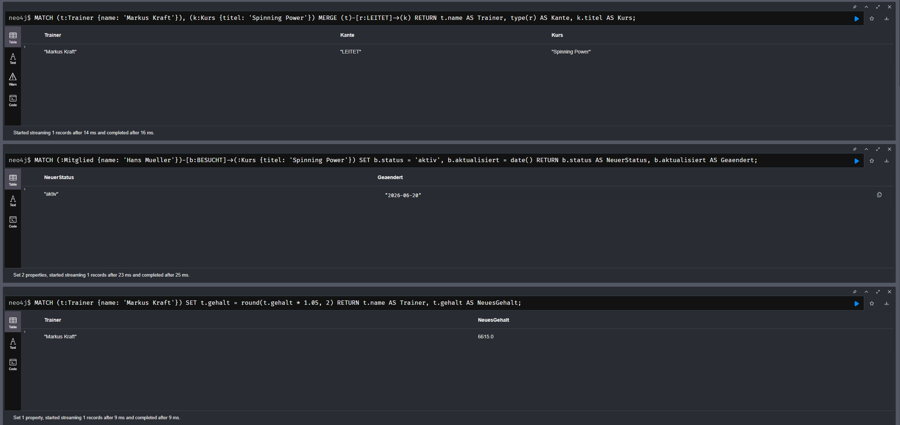
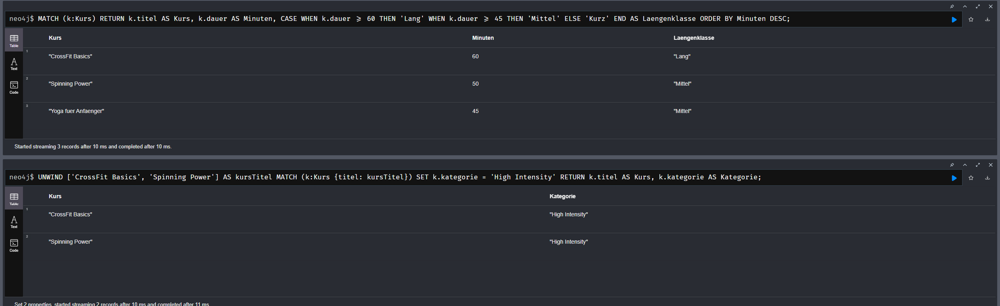

# Antworten zu KN-N-02: Datenabfrage und -Manipulation

Aufgabenstellung: [KN-N-02.md](./KN-N-02.md)

Themenwelt: Fitnessstudio **"SternFitness"** (Graph-Modell aus [KN-N-01](../KN-N-01/README.md)).
Alle Cypher-Statements liegen als ausführbare Skript-Dateien bei:

| Teil | Datei |
| :--- | :--- |
| A – Daten hinzufügen | [`A_create_data.txt`](file:///C:/Projects/M165-Thomas/KN-N-02/A_create_data.txt) |
| B – Daten abfragen | [`B_queries.txt`](file:///C:/Projects/M165-Thomas/KN-N-02/B_queries.txt) |
| C – Daten löschen | [`C_delete.txt`](file:///C:/Projects/M165-Thomas/KN-N-02/C_delete.txt) |
| D – Daten verändern | [`D_updates.txt`](file:///C:/Projects/M165-Thomas/KN-N-02/D_updates.txt) |
| E – Zusätzliche Klauseln | [`E_clauses.txt`](file:///C:/Projects/M165-Thomas/KN-N-02/E_clauses.txt) |

---

## Teil A: Daten hinzufügen

Mit einem **einzigen grossen `CREATE`-Statement** werden alle Knoten (3 Trainer, 3 Kurse, 4 Mitglieder, 4 Geräte) und alle Kanten (`LEITET`, `BESUCHT`, `NUTZT`) in einem Durchgang angelegt. Die Knoten werden über Variablen (`t1`, `k1`, `m1`, `g1` …) referenziert, sodass die Kanten direkt im selben Statement gesetzt werden können.

```cypher
CREATE
  (t1:Trainer {trainerId: 1, name: 'Thomas Stern', ...}),
  ...
  (m1)-[:BESUCHT {anmeldedatum: date('2025-02-02'), status: 'aktiv'}]->(k1),
  (k3)-[:NUTZT {anzahl: 10}]->(g3);
```

**Abgabe: Screenshot der erfolgreichen Ausführung**



*(Reproduktion: Inhalt von `A_create_data.txt` in den Neo4j Browser kopieren und ausführen; danach `MATCH (n) RETURN n` für die Graph-Visualisierung. Tipp: vorher mit `MATCH (n) DETACH DELETE n;` aufräumen.)*

---

## Teil B: Daten abfragen

### Erklärung: "Alle Knoten und Kanten lesen" und die `OPTIONAL MATCH`-Klausel

```cypher
MATCH (n)
OPTIONAL MATCH (n)-[r]->(m)
RETURN n, r, m;
```

- **`MATCH (n)`** bindet **jeden** Knoten der Datenbank an die Variable `n` (kein Label, kein Filter → alle Knoten).
- **`OPTIONAL MATCH (n)-[r]->(m)`** versucht, von jedem `n` ausgehende Kanten `r` zu Nachbarknoten `m` zu finden. Das Schlüsselwort **`OPTIONAL`** wirkt wie ein **LEFT OUTER JOIN** in SQL: Findet ein Knoten keine passende Kante, wird die Zeile **trotzdem** zurückgegeben – `r` und `m` sind dann schlicht `null`.
- **Wozu `OPTIONAL`?** Ein normales `MATCH (n)-[r]->(m)` würde alle Knoten **ohne ausgehende Kante herausfiltern**. In unserer Welt hätte man dann z. B. "Sam Jones" (besucht keinen Kurs) oder isolierte Geräte nicht gesehen. `OPTIONAL MATCH` garantiert, dass **wirklich alle** Knoten im Ergebnis erscheinen – auch die unverbundenen.
- **`RETURN n, r, m`** gibt Knoten, Kante und Nachbar zurück; der Neo4j Browser zeichnet daraus den vollständigen Graphen.

### Die 4 Szenarien

#### Szenario 1 — Aktive Teilnehmer der Kurse von Thomas Stern *(WHERE)*
**Anwendungsfall:** Der Trainer Thomas Stern möchte vor Kursbeginn die Liste seiner aktiv angemeldeten Mitglieder. Dies erfordert eine Traversierung über zwei Kanten: `Mitglied -BESUCHT-> Kurs <-LEITET- Trainer`.
```cypher
MATCH (mit:Mitglied)-[b:BESUCHT]->(k:Kurs)<-[:LEITET]-(t:Trainer)
WHERE t.name = 'Thomas Stern' AND b.status = 'aktiv'
RETURN mit.name AS Mitglied, k.titel AS Kurs, b.anmeldedatum AS Angemeldet;
```

#### Szenario 2 — Kurs-Empfehlung (Collaborative Filtering)
**Anwendungsfall:** Hans Mueller soll passende neue Kurse vorgeschlagen bekommen. Logik: "Mitglieder, die einen Kurs mit Hans teilen, besuchen ausserdem folgende Kurse, die Hans noch nicht besucht." Genau hierfür sind Graphdatenbanken stark.
```cypher
MATCH (hans:Mitglied {name: 'Hans Mueller'})-[:BESUCHT]->(:Kurs)
      <-[:BESUCHT]-(other:Mitglied)-[:BESUCHT]->(empfehlung:Kurs)
WHERE other <> hans AND NOT (hans)-[:BESUCHT]->(empfehlung)
RETURN DISTINCT empfehlung.titel AS Empfehlung;
```

#### Szenario 3 — Gesamtbedarf je Gerät *(Aggregation über Kanten-Attribut)*
**Anwendungsfall:** Die Materialverwaltung will wissen, wie viele Exemplare jedes Geräts insgesamt über alle Kurse hinweg gebunden sind. Aggregiert wird das Kanten-Attribut `anzahl` der `NUTZT`-Beziehung.
```cypher
MATCH (k:Kurs)-[u:NUTZT]->(g:Geraet)
RETURN g.bezeichnung AS Geraet,
       sum(u.anzahl) AS GesamtBedarf,
       collect(k.titel) AS GenutztInKursen
ORDER BY GesamtBedarf DESC;
```

#### Szenario 4 — Kursauslastung und freie Plätze *(OPTIONAL MATCH + WHERE)*
**Anwendungsfall:** Die Rezeption braucht eine Übersicht, wie viele Plätze pro Kurs noch frei sind. Dank `OPTIONAL MATCH` erscheinen auch Kurse mit **null** aktiven Anmeldungen.
```cypher
MATCH (k:Kurs)
OPTIONAL MATCH (mit:Mitglied)-[b:BESUCHT]->(k)
WHERE b.status = 'aktiv'
WITH k, count(mit) AS aktiveAnmeldungen
RETURN k.titel AS Kurs,
       aktiveAnmeldungen,
       k.maxTeilnehmer - aktiveAnmeldungen AS FreiePlaetze
ORDER BY FreiePlaetze ASC;
```

> Die `WHERE`-Klausel wird in **Szenario 1, 2 und 4** eingesetzt (Bedingung "mind. 2" erfüllt). Die Szenarien kombinieren Knoten- und Kanten-Abfragen und gehen bewusst über einfache Ein-Attribut-Filter hinaus.

**Abgabe: Screenshot der ausgeführten Abfragen**



---

## Teil C: Daten löschen — `DELETE` vs. `DETACH DELETE`

Als Startobjekt dient **beide Male** dasselbe Mitglied **"Hans Mueller"**, das noch Kanten (`BESUCHT`) besitzt.

### Fall 1 — `DELETE` ohne `DETACH` → schlägt fehl
```cypher
MATCH (hans:Mitglied {name: 'Hans Mueller'})
DELETE hans;
```
Neo4j **verweigert** das Löschen, weil der Knoten noch Kanten hat. Dies schützt vor verwaisten ("dangling") Beziehungen.
Fehlermeldung:
> `Cannot delete node<id>, because it still has relationships. To delete this node, you must first delete its relationships.`

### Fall 2 — `DETACH DELETE` → erfolgreich
```cypher
MATCH (hans:Mitglied {name: 'Hans Mueller'})
DETACH DELETE hans;
```
`DETACH` entfernt **zuerst automatisch alle Kanten** des Knotens und löscht **danach** den Knoten selbst. Die Kontrollabfrage liefert anschliessend 0 Zeilen.

**Abgaben: Vorher-/Nachher-Screenshots beider Fälle**

| | Vorher | Nachher |
| :--- | :--- | :--- |
| **Fall 1 (`DELETE`)** |  |  |
| **Fall 2 (`DETACH DELETE`)** |  |  |

*(Hinweis: Nach dem Löschen `A_create_data.txt` erneut ausführen, um den Datenbestand für Teil D wiederherzustellen.)*

---

## Teil D: Daten verändern

#### Szenario 1 — Knoten-Attribut: Gehaltserhöhung für Markus Kraft
**Anwendungsfall:** Trainer Markus Kraft erhält eine Gehaltserhöhung von 5 %. `SET` berechnet den neuen Wert direkt aus dem alten.
```cypher
MATCH (t:Trainer {name: 'Markus Kraft'})
SET t.gehalt = round(t.gehalt * 1.05, 2)
RETURN t.name AS Trainer, t.gehalt AS NeuesGehalt;
```

#### Szenario 2 — Kanten-Attribut: Nachrücken von der Warteliste
**Anwendungsfall:** Hans Mueller rückt im Kurs "Spinning Power" von der Warteliste nach. Geändert wird das Attribut `status` **auf der Kante** `[:BESUCHT]`, zusätzlich wird ein Änderungsdatum gesetzt.
```cypher
MATCH (:Mitglied {name: 'Hans Mueller'})-[b:BESUCHT]->(:Kurs {titel: 'Spinning Power'})
SET b.status = 'aktiv', b.aktualisiert = date()
RETURN b.status AS NeuerStatus, b.aktualisiert AS Geaendert;
```

#### Szenario 3 — Kante manipulieren: Kursleitung neu zuweisen
**Anwendungsfall:** Der bisher kurslose Trainer Markus Kraft übernimmt zusätzlich die Leitung von "Spinning Power". `MERGE` legt die `LEITET`-Kante **nur an, wenn sie noch nicht existiert** (idempotent, keine Duplikate).
```cypher
MATCH (t:Trainer {name: 'Markus Kraft'}), (k:Kurs {titel: 'Spinning Power'})
MERGE (t)-[r:LEITET]->(k)
RETURN t.name AS Trainer, type(r) AS Kante, k.titel AS Kurs;
```

**Abgabe: Screenshot der ausgeführten Updates**



---

## Teil E: Zusätzliche Klauseln

### Klausel 1 — `UNWIND`
`UNWIND` ist das Gegenstück zu `collect()`: Es **zerlegt eine Liste in einzelne Zeilen**. Jedes Listenelement wird zu einer eigenen Datenzeile, mit der dann weitergearbeitet werden kann (z. B. um aus einer Liste viele Knoten/Kanten zu erzeugen oder mehrere Werte einzeln zu verarbeiten).
```cypher
UNWIND ['CrossFit Basics', 'Spinning Power'] AS kursTitel
MATCH (k:Kurs {titel: kursTitel})
SET k.kategorie = 'High Intensity'
RETURN k.titel AS Kurs, k.kategorie AS Kategorie;
```
*Erklärung:* Die Liste der zwei Kurstitel wird in zwei Zeilen aufgeteilt; für jede Zeile sucht `MATCH` den passenden Kurs und setzt die Kategorie. So lassen sich mehrere Knoten in einem Statement gezielt bearbeiten.

### Klausel 2 — `CASE`
`CASE` ermöglicht **bedingte Ausdrücke** (vergleichbar mit `if/else`). Abhängig von einer Bedingung wird ein anderer Wert zurückgegeben – ohne mehrere separate Abfragen.
```cypher
MATCH (k:Kurs)
RETURN k.titel AS Kurs,
       k.dauer AS Minuten,
       CASE
         WHEN k.dauer >= 60 THEN 'Lang'
         WHEN k.dauer >= 45 THEN 'Mittel'
         ELSE 'Kurz'
       END AS Laengenklasse
ORDER BY Minuten DESC;
```
*Erklärung:* Jeder Kurs wird anhand seiner `dauer` in eine Längenklasse ("Lang", "Mittel", "Kurz") eingeteilt. `CASE` prüft die Bedingungen von oben nach unten und liefert den ersten zutreffenden Wert.

**Abgabe: Screenshot der ausgeführten Klausel-Beispiele**


