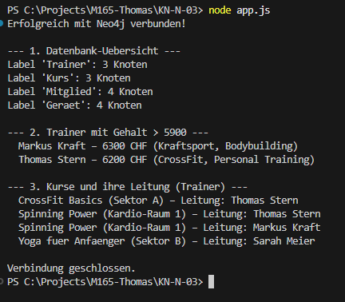

# Antworten zu KN-N-03: Programmierung mit Neo4j

Aufgabenstellung: [KN-N-03.md](./KN-N-03.md)

Wir greifen mit einer **Node.js-Konsolenapplikation** über den offiziellen **Neo4j JavaScript Driver** (`neo4j-driver`) auf die Graph-Datenbank `SternFitness` aus [KN-N-02](../KN-N-02/README.md) zu. Die Quellcodedateien:
*   **Node.js-Skript:** [`app.js`](file:///C:/Projects/M165-Thomas/KN-N-03/app.js)
*   **Package-Konfiguration:** [`package.json`](file:///C:/Projects/M165-Thomas/KN-N-03/package.json)

---

## Installation & Ausführung

1.  **Voraussetzungen:** Node.js (inkl. npm) ist installiert und die Neo4j-Datenbank aus KN-N-01 läuft (Status **Active**). Die Daten aus [`A_create_data.txt`](file:///C:/Projects/M165-Thomas/KN-N-02/A_create_data.txt) sind eingespielt.
2.  **Verbindungsdaten prüfen:** In `app.js` sind oben `URI`, `USER` und `PASSWORD` gesetzt (lokal: `neo4j://localhost:7687`, Benutzer `neo4j`, Passwort `Thomas-Password`). Bei **Neo4j Aura** stattdessen die `neo4j+s://…`-URI und das Aura-Passwort eintragen.
3.  **Dependencies installieren:** Im Ordner `KN-N-03`:
    ```bash
    npm install
    ```
    Dies installiert die in der `package.json` definierte Bibliothek `neo4j-driver`.
4.  **Applikation starten:**
    ```bash
    node app.js
    ```

---

## Code-Erklärung

Das Skript [`app.js`](file:///C:/Projects/M165-Thomas/KN-N-03/app.js) arbeitet asynchron (`async/await`):

1.  **Treiber & Verbindung:**
    ```javascript
    const neo4j = require('neo4j-driver');
    const driver = neo4j.driver(URI, neo4j.auth.basic(USER, PASSWORD));
    await driver.verifyConnectivity();
    ```
    *Erklärung:* Es wird **ein** `driver`-Objekt erstellt (langlebig, thread-safe). Für die eigentlichen Abfragen wird daraus eine kurzlebige `session` geöffnet. `verifyConnectivity()` prüft die Verbindung früh und liefert eine klare Fehlermeldung, falls die DB nicht läuft.

2.  **Knoten zählen (pro Label):**
    Das Skript iteriert über die Labels und führt `MATCH (n:Label) RETURN count(n)` aus. Da Neo4j-Zähler als 64-Bit-Integer zurückkommen, wird `.toNumber()` verwendet.

3.  **Parametrisierte Abfrage (`$grenze`):**
    ```javascript
    await session.run(
      `MATCH (t:Trainer) WHERE t.gehalt > $grenze
       RETURN t.name AS name, t.gehalt AS gehalt, t.spezialisierung AS spezialisierung
       ORDER BY t.gehalt DESC`,
      { grenze: 5900 }
    );
    ```
    *Erklärung:* Werte werden **als Parameter** ($grenze) übergeben, nicht in den String eingebaut. Das schützt vor Cypher-Injection und erlaubt dem Server, den Query-Plan zu cachen.

4.  **Graph-Traversierung (Join über Kante):**
    ```javascript
    `MATCH (t:Trainer)-[:LEITET]->(k:Kurs)
     RETURN k.titel AS kurs, k.raum AS raum, t.name AS leitung`
    ```
    *Erklärung:* Dieselbe relationale Verknüpfung wie in KN-N-02 – hier programmatisch. Über die Kante `[:LEITET]` werden Kurse mit ihren Trainer:innen verbunden.

5.  **Ressourcen schliessen:**
    Im `finally`-Block werden `session.close()` und `driver.close()` aufgerufen, um offene Verbindungen sauber freizugeben.

---

## Visualisierung der Ausführung

Der folgende Screenshot zeigt die Konsolenausgabe nach `node app.js` (Übersicht der Knotenzahlen, gut bezahlte Trainer und die Kurs-Leitungen):


