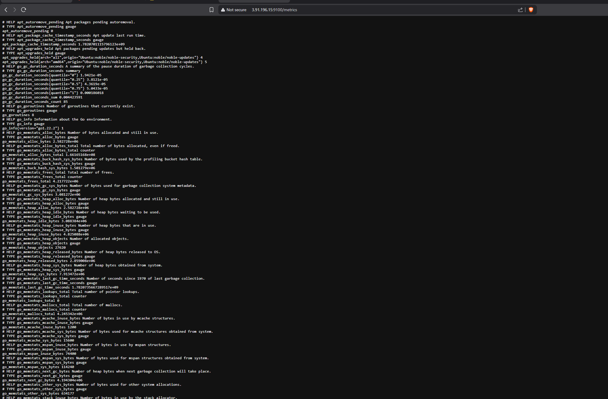
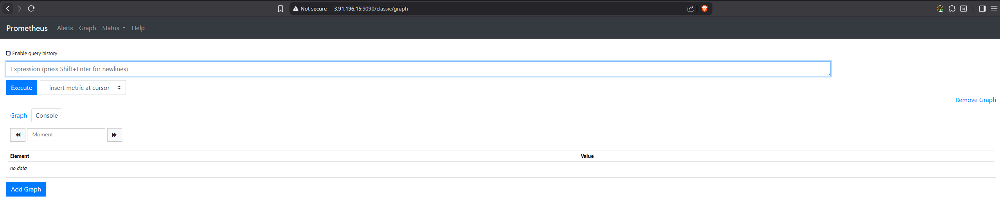
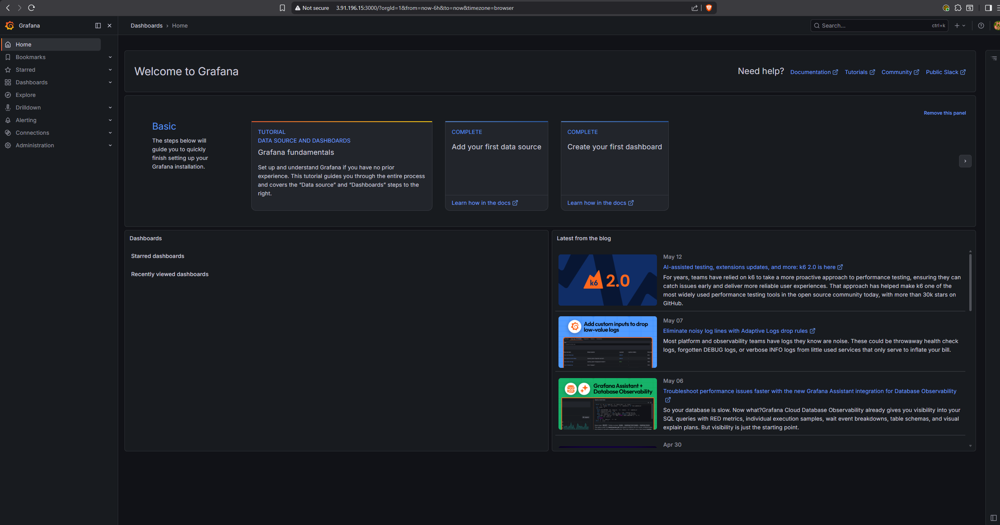
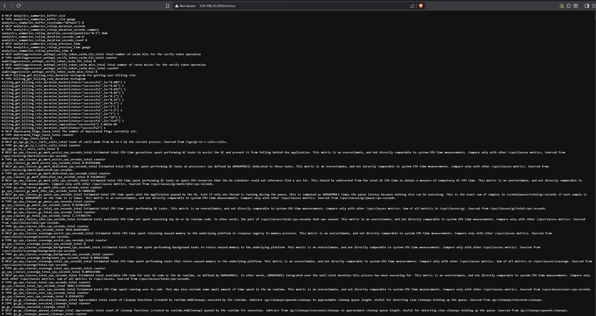

# KN-P-01: Installation von Prometheus und Grafana

## A) Installation

### Beschreibung
Mit dem bereitgestellten Cloud-Init-Skript [`cloud-init-prometheus.yaml`](./cloud-init-prometheus.yaml) wurde eine AWS-Instanz (Ubuntu 24.04, t3.medium, 20 GB) aufgesetzt. Das Skript installiert und startet **Prometheus**, den **Prometheus Node-Exporter** und **Grafana**. Die Ports 22, 3000, 9090 und 9100 sind in der Security-Group geöffnet. Die vier geforderten Seiten aus der Installationsanleitung sind erreichbar (IP im Screenshot sichtbar).

### Screenshots
**1. Node-Exporter Metrics (`:9100/metrics`):**

**2. Prometheus Dashboard (`:9090`):**

**3. Grafana Dashboard (`:3000`):**

**4. Grafana Metrics (`:3000/metrics`):**

---

## B) Erklärungen Cloud-Init

### 1. Was sind *Scrapes*?
Prometheus arbeitet nach dem **Pull-Prinzip**: Es fragt seine Ziele aktiv ab, statt darauf zu warten, dass diese Daten senden. Ein *Scrape* ist genau dieser periodische Abruf — ein HTTP-`GET` auf den `/metrics`-Endpoint eines Ziels, dessen Antwort (im Prometheus-Exposition-Format) eingelesen und mit einem Zeitstempel gespeichert wird.

Festgelegt werden Scrapes im Abschnitt `scrape_configs` der `prometheus.yml`. Jeder `job_name` bündelt eine oder mehrere `targets` (Host:Port), das Intervall steuert `scrape_interval` (hier global `15s`).

**Konkrete Beispiele aus der Cloud-Init-Datei:**
- Job `prometheus` scrapt `localhost:9090` — Prometheus überwacht sich selbst.
- Job `node` scrapt `localhost:9100` — der Node-Exporter liefert System-Kennzahlen (CPU, RAM, Disk, Netzwerk).
- (In KN-P-02 ergänzt: Job `sternfitness_app`, der die eigene App unter `:8080/metrics` scrapt.)

### 2. Was sind *Rules*?
*Rules* sind in `rules.yml` definierte Regeln, die Prometheus regelmässig auf den gesammelten Daten auswertet. Eingebunden werden sie über `rule_files`. Es gibt zwei Arten:

- **Recording Rules** (`record:`) — berechnen einen PromQL-Ausdruck im Voraus und speichern das Ergebnis als **neue Zeitreihe**. Das beschleunigt häufige/teure Abfragen und Dashboards.
- **Alerting Rules** (`alert:`) — lösen einen **Alarm** aus, sobald ein Ausdruck für die Dauer `for:` wahr bleibt.

**Konkrete Beispiele aus der Cloud-Init-Datei:**
- Recording Rule `node_memory_MemFree_percent` = `100 - (100 * node_memory_MemFree_bytes / node_memory_MemTotal_bytes)` → freier Arbeitsspeicher in Prozent.
- Recording Rule `node_filesystem_free_percent` → freier Plattenplatz von `/` in Prozent.
- Alerting Rule `InstanceDown` mit `expr: up == 0`, `for: 1m` → meldet ein Ziel, das länger als eine Minute nicht erreichbar ist.

### 3. Schritte, um eigene Daten in Prometheus zu speichern
1. **Metrik bereitstellen:** Die eigene Applikation muss einen HTTP-Endpoint (üblich `/metrics`) anbieten, der die Kennzahlen im **Prometheus-Exposition-Format** ausgibt (`# HELP`, `# TYPE`, dann `metrik_name wert`).
2. **App erreichbar hosten:** Die App auf einem Server betreiben, dessen Port von Prometheus erreichbar ist.
3. **Scrape-Job eintragen:** In `prometheus.yml` unter `scrape_configs` einen neuen `job_name` mit dem `target` (Host:Port) hinzufügen.
4. **Prometheus neu laden:** `systemctl reload/restart prometheus` (bzw. Reload-Endpoint), damit der neue Job aktiv wird.
5. **(Optional) Auswerten:** Recording-/Alerting-Rules ergänzen und die Daten in Grafana visualisieren.

Genau dieser Ablauf wird in **KN-P-02** umgesetzt.

### 4. Welche Variablen werden in Scrapes und Rules verwendet — und woher kommen sie?
- **In den Scrapes:** `scrape_interval` (global gesetzt), `job_name` und `targets` werden **manuell in `prometheus.yml`** definiert. Aus diesen Angaben erzeugt Prometheus beim Scrapen automatisch die Labels `job` (= `job_name`) und `instance` (= Adresse des Targets). Die eigentlichen **Metriknamen und Werte** (z. B. `node_memory_MemFree_bytes`) stammen von der `/metrics`-Seite des jeweiligen Ziels — beim Node-Exporter also von `http://<IP>:9100/metrics`.
- **In den Rules:** Die PromQL-Ausdrücke referenzieren Metriknamen wie `node_memory_MemFree_bytes`, `node_memory_MemTotal_bytes`, `node_filesystem_free_bytes{mountpoint="/"}`, `node_filesystem_size_bytes` und `up`. Diese kommen ebenfalls aus den gescrapten Zielen (Node-Exporter `:9100`), `up` erzeugt Prometheus selbst. Die Template-Platzhalter in den Annotations — `{{ $labels.instance }}`, `{{ $labels.job }}`, `{{ $value }}` — werden zur Laufzeit aus den Labels bzw. dem Wert der betroffenen Zeitreihe gefüllt.

### 5. Wie weiss Prometheus, ob ein System *up* ist?
Bei **jedem** Scrape schreibt Prometheus für jedes Ziel automatisch eine synthetische Metrik **`up`**: Wert `1`, wenn der Scrape erfolgreich war (Ziel erreichbar, HTTP 200, Antwort parsbar), sonst `0`. `up` wird also nicht vom Zielsystem gemeldet, sondern von Prometheus aus dem Scrape-Ergebnis abgeleitet.

Die Alerting Rule `InstanceDown` nutzt das: `expr: up == 0` mit `for: 1m`. Bleibt `up` für ein Ziel länger als eine Minute auf `0`, gilt das System als *down* und der Alarm `InstanceDown` feuert.

---

**Verwendete Datei:** [`cloud-init-prometheus.yaml`](./cloud-init-prometheus.yaml)
