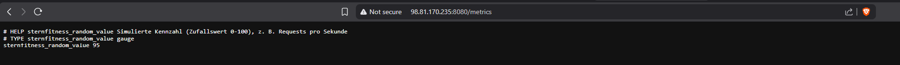
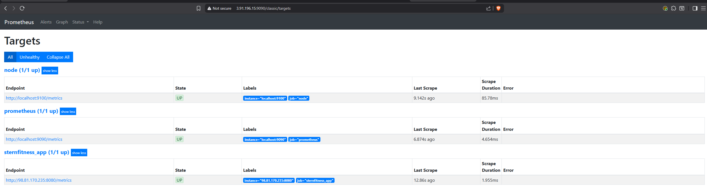
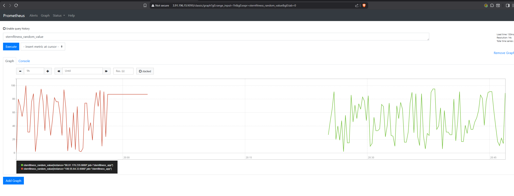
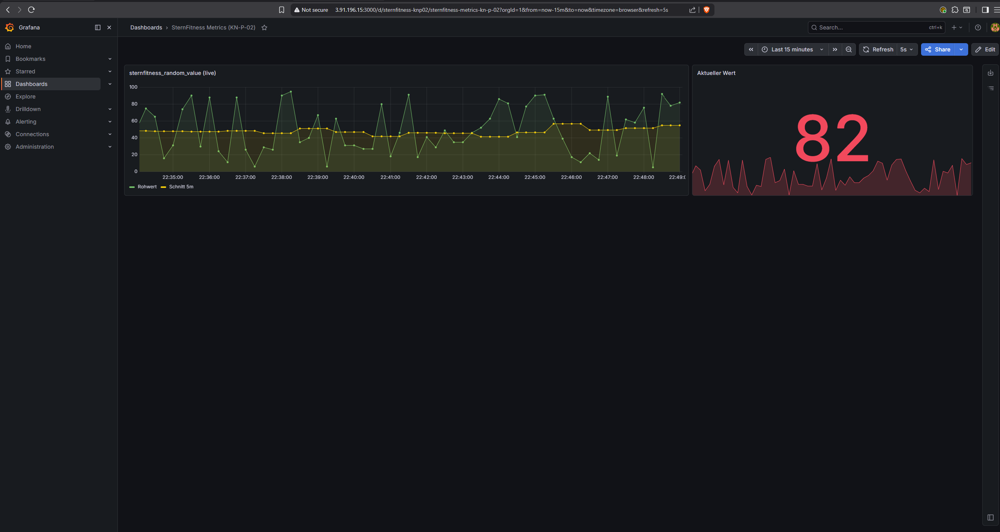

# KN-P-02: Implementation von eigenen Metrics

## A) Eigene Metriken schreiben

### Beschreibung
Mit **Node.js** wurde ein minimaler Web-Endpoint geschrieben ([`app/app.js`](./app/app.js)). Der Endpoint `/metrics` erzeugt bei jedem Aufruf eine **Zufallszahl zwischen 0 und 100** und gibt sie im **Prometheus-Exposition-Format** aus. Das simuliert eine konkrete Kennzahl (z. B. Requests pro Sekunde). Wie in der Aufgabe erlaubt, ist es bewusst ein einfacher Controller ohne Layer-Trennung.

### Ausgabe des Endpoints
```text
# HELP sternfitness_random_value Simulierte Kennzahl (Zufallswert 0-100), z. B. Requests pro Sekunde
# TYPE sternfitness_random_value gauge
sternfitness_random_value 42
```

### Screenshot
**`/metrics`-Endpoint der App (Zufallszahl 0–100):**


**Datei:** [`app/app.js`](./app/app.js)

---

## B) Umgebung einrichten

### Beschreibung
Die App wird auf einem **zusätzlichen AWS-Server** (Ubuntu 24.04, t3.micro, getrennt vom Prometheus-Server) gehostet. Das Cloud-Init-Skript [`cloud-init-metrics-app.yaml`](./cloud-init-metrics-app.yaml) installiert Node.js, legt `app.js` ab und startet sie als **systemd-Service** (`metrics-app.service`), damit der Endpoint dauerhaft läuft. Port 8080 ist in der Security-Group geöffnet.

### Prometheus erweitern (Scrapes & Rules)
In der `prometheus.yml` wurde ein neuer Scrape-Job ergänzt, der die App scrapt ([`prometheus/prometheus.yml`](./prometheus/prometheus.yml)):
```yaml
  - job_name: sternfitness_app
    static_configs:
      - targets: ['<APP_IP>:8080']
```
In der `rules.yml` wurde eine eigene Recording- und Alerting-Rule auf der neuen Metrik ergänzt ([`prometheus/rules.yml`](./prometheus/rules.yml)):
```yaml
  - name: sternfitness_rules
    rules:
      - record: sternfitness_random_value_avg5m
        expr: avg_over_time(sternfitness_random_value[5m])
      - alert: SternFitnessHighLoad
        expr: sternfitness_random_value > 80
        for: 1m
```
Nach dem Eintragen wird Prometheus neu geladen (`sudo systemctl restart prometheus`). Das Ziel erscheint danach unter *Status → Targets* als **UP**.

### Screenshots
**Prometheus-Target `sternfitness_app` ist UP:**


**Abfrage `sternfitness_random_value` im Prometheus-Graph:**


### Grafana-Dashboard erweitern
Das Grafana-Dashboard wurde um die eigene Metrik erweitert ([`grafana/sternfitness-dashboard.json`](./grafana/sternfitness-dashboard.json)): ein Zeitreihen-Panel (`sternfitness_random_value` plus 5-Minuten-Schnitt) und ein Stat-Panel mit Schwellwert-Färbung. Datenquelle ist der Prometheus-Server.

**Grafana-Dashboard mit der eigenen Metrik:**


---

**Verwendete Dateien:** [`app/app.js`](./app/app.js) · [`cloud-init-metrics-app.yaml`](./cloud-init-metrics-app.yaml) · [`prometheus/prometheus.yml`](./prometheus/prometheus.yml) · [`prometheus/rules.yml`](./prometheus/rules.yml) · [`grafana/sternfitness-dashboard.json`](./grafana/sternfitness-dashboard.json)
