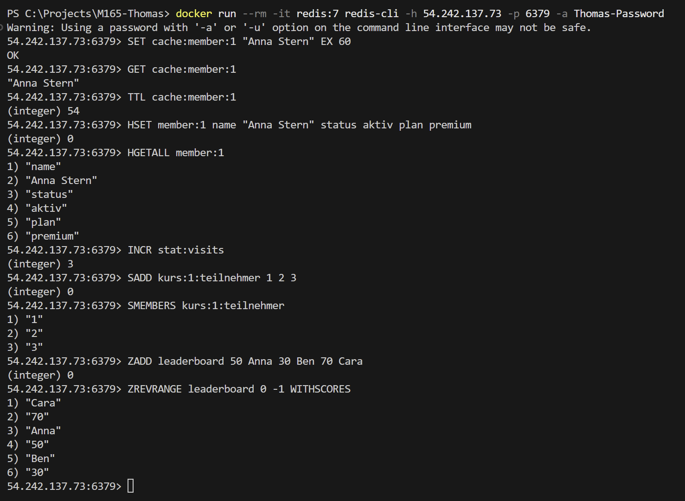
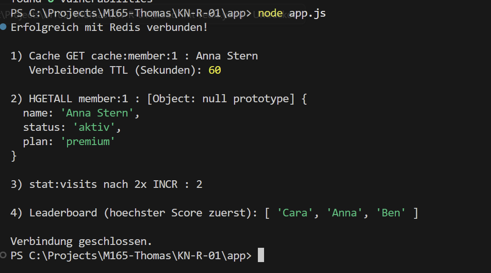

# KN-R-01: Key-Value-Datenbank (Redis) kennenlernen

## Beschreibung
Redis ist die meistverbreitete **Key-Value-Datenbank** und arbeitet **in-memory** (Daten liegen im RAM), was sie ideal für Caching macht. Für diesen KN läuft Redis 7 als **Docker-Image** auf einer eigenen AWS-Instanz ([`cloud-init-redis.yaml`](./cloud-init-redis.yaml), Port 6379, Passwort-Auth, `appendonly`-Persistenz). Getestet wird die Datenbank über die **CLI** (`redis-cli`) und über die **Programmierschnittstelle** (Node.js-Treiber). Alle Beispiele nutzen das Fitnessstudio „SternFitness".

---

## A) CLI — `redis-cli`

### Beschreibung
Verbindung mit `redis-cli` und Test der wichtigsten Key-Value-Funktionen samt der **in-memory Caching-Funktion** mit Ablaufzeit (TTL). Die Befehle stehen re-runnable in [`redis_demo.txt`](./redis_demo.txt).

### Getestete Funktionen / Befehle
| Funktion | Befehl(e) | Zweck |
| :--- | :--- | :--- |
| String + TTL (Caching) | `SET cache:member:1 "Anna Stern" EX 60` · `GET` · `TTL` | in-memory Cache, der nach 60 s automatisch abläuft |
| Hash | `HSET member:1 name "Anna Stern" status aktiv plan premium` · `HGETALL member:1` | Mitglieds-Profil als Feld-Wert-Paare |
| Counter | `SET stat:visits 0` · `INCR stat:visits` | atomares Hochzählen (z. B. Studio-Besuche) |
| Set | `SADD kurs:1:teilnehmer 1 2 3` · `SMEMBERS` · `SCARD` | eindeutige Teilnehmer eines Kurses |
| Sorted Set | `ZADD leaderboard 50 Anna 30 Ben 70 Cara` · `ZREVRANGE leaderboard 0 -1 WITHSCORES` | Leaderboard der aktivsten Mitglieder |

### Screenshot
**`redis-cli`-Sitzung mit Datenstrukturen und TTL-Caching:**


---

## B) Programmierschnittstelle — Node.js

### Beschreibung
Zugriff über den offiziellen `redis`-Treiber ([`app/app.js`](./app/app.js)). Das Programm verbindet sich, legt einen Cache mit TTL an, schreibt/liest einen Hash, zählt einen Counter hoch und füllt ein Sorted-Set-Leaderboard — dieselben Funktionen wie in der CLI, aber programmatisch.

### Befehle
```bash
cd C:\Projects\M165-Thomas\KN-R-01\app
npm install
node app.js
```

### Screenshot
**Konsolenausgabe von `node app.js`:**


---

**Verwendete Dateien:** [`cloud-init-redis.yaml`](./cloud-init-redis.yaml) · [`redis_demo.txt`](./redis_demo.txt) · [`app/app.js`](./app/app.js)
